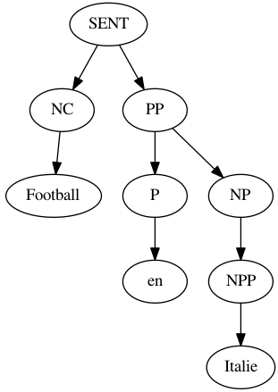
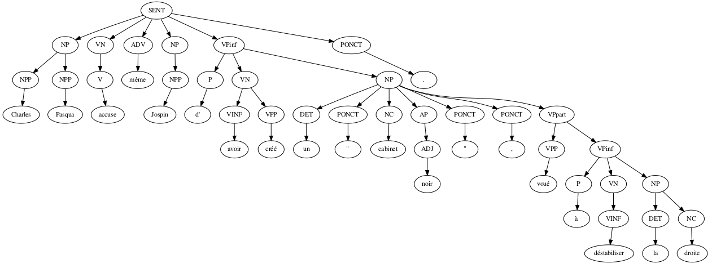

# LanguageParsing
In this project I developed a probabilistic parser for french (or any other) language. The system is robust to unknown words and typos and is based on Probabilistic Context Free Grammars, the Levenshtein distance, word embeddings and a probabilistic CYK-algorithm. The 
parser is trained on the SEQUOIA database, reads in a sentence and outputs a predicted parse tree.

In an evaluation on the test set of the SEQUOIA database the system achieved 87.7% measured as POS-tag label accuracy.

## How to run:
    1. python code/main.py
    2. Wait a few seconds to learn the PCFG.
    2. Enter a new sentence to be parsed.

## Examples:

#### Example 1:
```
python ./code/main.py
Enter space separated tokens:
Football en Italiee
parsed as:
( (SENT (NC Football) (PP (P en) (NP (NPP Italie)))))
```



#### Example 2 (test set):

Input sentence: Charles Pasqua accuse même Jospin d'avoir créé un " cabinet noir " , voué à déstabiliser la droite 

Prediction:

Ground truth:

